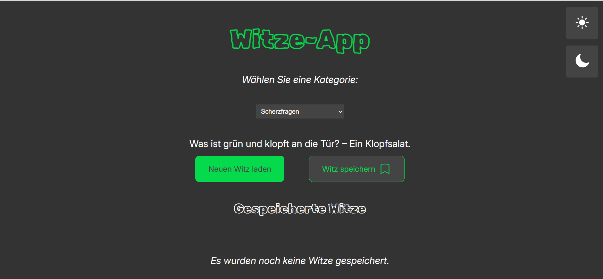

# Witze-App



Eine responsive Webanwendung, die Witze von einer öffentlichen API abruft und dynamisch darstellt. Die App verfügt über ein flexibles Farbschema, welches sowohl automatisiert auf die Systemeinstellungen des Endgeräts reagiert, als auch eine manuelle Steuerung durch den Benutzer ermöglicht.

## Voraussetzungen
Für die lokale Ausführung und das Kompilieren des Projekts werden folgende Komponenten benötigt:
* Node.js (aktuelle LTS-Version)
* Einen modernen Webbrowser
* Git (optional, falls Sie das Repository klonen möchten)

## Technologien
* **HTML5:** Strukturierung des Anwendungsfensters, Einbettung von SVG-Vektorgrafiken für Steuerungselemente und Definition des Kategorie-Auswahlmenüs.
* **SCSS:** Modulares Styling unter Verwendung von Variablen, verschachtelten Selektoren (Nesting) und einem `@mixin` zur Standardisierung von Hover-Zuständen mit Helligkeitsfiltern.
* **Google Fonts:** Einbindung der Schriftarten Inter für Fließtexte sowie Rubik Scribble für markante Überschriften.
* **Vite:** Frontend-Build-Tool für eine performante Entwicklungsumgebung und die Paketierung im Produktionsmodus.
* **JavaScript (Vanilla JS):** Asynchrone API-Abrufe mit der Fetch-API und ES-Modulen, Fehlerbehandlung durch try-catch, dauerhafte Datenspeicherung im Local Storage sowie dynamische DOM-Inhalte mit isolierten Events.
* 
## Installation
Klonen Sie das Projekt auf Ihren lokalen Computer und installieren Sie die erforderlichen Abhängigkeiten über den Paketmanager:

```bash
# Repository klonen
git clone https://github.com

# In den Projektordner navigieren
cd witze-app

# Abhängigkeiten installieren
npm install
```

## Nutzung
1. Starten Sie den lokalen Vite-Entwicklungsserver mit folgendem Befehl:
   ```bash
   npm run dev
   ```
2. Öffnen Sie die in der Konsole angezeigte lokale URL (Standard: `http://localhost:5173`) in Ihrem Webbrowser.
3. Wählen Sie im Dropdown-Menü eine gewünschte Kategorie (Programmierwitze, Schulwitze oder Scherzfragen) aus, die an die Schnittstelle von `witzapi.de` übergeben wird.
4. Klicken Sie auf „Neuen Witz laden“, um den asynchronen API-Abruf zu starten und den Text im Container anzuzeigen.
5. Sichern Sie geladene Witze lokal über die dynamisch generierte Schaltfläche „Witz speichern“, welche Duplikate mittels ID-Prüfung filtert.
6. Verwalten Sie Ihre Favoriten im Bereich „Gespeicherte Witze“; Einträge können über das integrierte Lesezeichen-Symbol dauerhaft aus dem Speicher und der Ansicht gelöscht werden.
7. Passen Sie das visuelle Erscheinungsbild manuell über die fest positionierten Modus-Schaltflächen (Sonne/Mond) an oder überlassen Sie die Farbdarstellung der automatischen Erkennung des Betriebssystems (`prefers-color-scheme`).

## Deployment
Die Anwendung kann für die Veröffentlichung gebaut und statisch gehostet werden:
1. Erzeugen Sie die produktionsbereiten Dateien im `dist`-Ordner:
   ```bash
   npm run build
   ```
2. Der Inhalt dieses Ordners kann anschließend direkt über GitHub Pages, Vercel oder Netlify live schaltet werden.

## Lizenz
Dieses Projekt wurde von Xenia Wilczek erstellt. Alle Rechte an Code und Design vorbehalten (All Rights Reserved).
